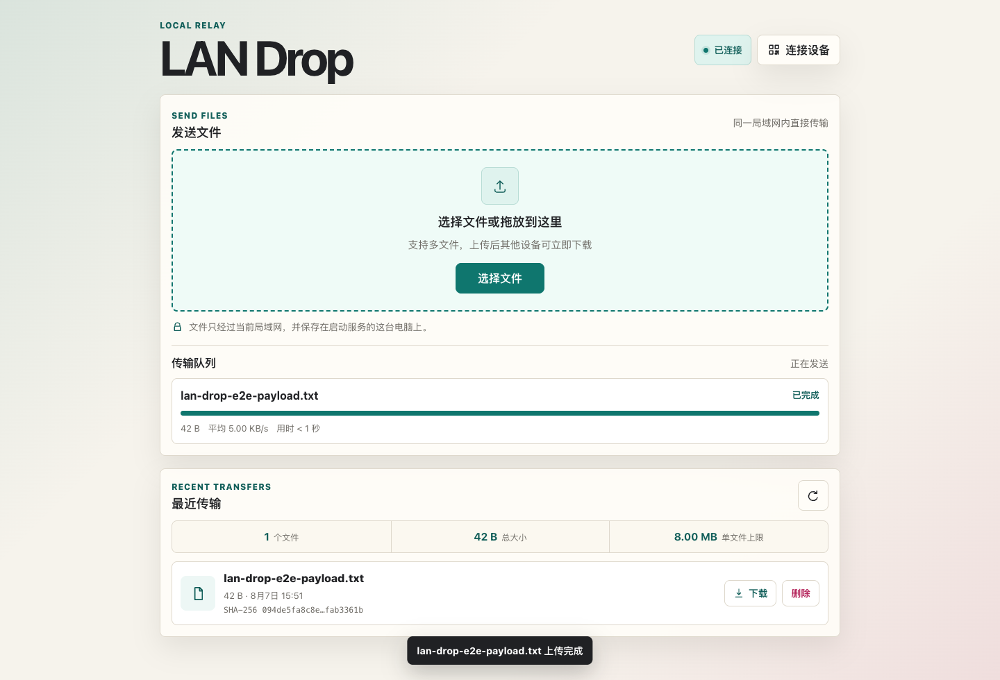

# LAN Drop

[](https://github.com/chilltongx/lan-drop/actions/workflows/ci.yml)

一个使用 Go 编写的局域网文件快传工具。主机启动服务后，手机或其他电脑直接打开浏览器即可上传和下载文件。

项目同时包含面向三星 One UI 的原生 Android 客户端：支持系统相机拍照、预览确认上传、文件选择和 SSE 实时列表。



## 功能

- 浏览器拖拽上传和多文件队列
- 二维码连接新设备，无需手输局域网地址
- 实时上传进度、速度、预计剩余时间与取消操作
- 流式写入磁盘，上传时同步计算 SHA-256
- 文件列表、下载、删除和同名文件自动编号
- SSE 实时同步，一台设备操作后其他页面无需刷新
- HTTP Range 下载，支持浏览器续传
- 启动连接码、HttpOnly/SameSite Cookie 与登录防爆破
- 请求 ID、结构化访问日志与 `/healthz` 健康检查
- 参考 Pass 的清爽响应式界面，支持减少动态效果
- 单个 Go 二进制，网页资源已嵌入程序
- 三星 Android 原生客户端，拍照上传且无需相机或媒体库权限

## 面试亮点

- 流式上传与同步 SHA-256，内存占用不随文件大小线性增长
- 临时文件 + `Rename` 原子发布，元数据索引原子替换
- `RWMutex` 并发控制，同名并发上传测试与 race detector
- SSE 事件广播、有限 channel 和非阻塞背压策略
- 常量时间认证、每 IP 限流、路径穿越防护与明确的信任边界
- CI 执行依赖校验、`go vet`、race test 和构建
- Android 端展示 FileProvider、StateFlow、协程取消和 API 37 局域网权限适配

详细的开源项目对标、设计取舍、性能基线、演进路线和 90 秒讲法见[《面试设计说明》](docs/面试设计说明.md)。

## 快速开始

需要 Go 1.26 或更新版本。

```bash
cd /Users/x/Go/lan-drop
go run ./cmd/lan-drop
```

启动后会自动打开浏览器，终端同时显示连接码和可访问地址：

```text
LAN Drop 已启动
连接码：482901
共享目录：/Users/you/lan-drop/shared
打开：http://192.168.1.20:8080/?token=482901
```

在同一局域网设备中打开终端显示的地址即可。首次打开带连接码的地址会自动建立会话，也可以在页面中手动输入连接码。

已经连接的设备可以点击页面右上角的“连接设备”，让手机或另一台电脑扫描二维码加入。二维码包含当前连接码，只应分享给可信设备。

## 构建

```bash
go build -o lan-drop ./cmd/lan-drop
./lan-drop
```

三星 Android 客户端需要 JDK 17 和 Android SDK Platform 37：

```bash
cd android
./gradlew testDebugUnitTest lintDebug assembleDebug assembleDebugAndroidTest
```

安装和设计说明见 [android/README.md](android/README.md)。

常用参数：

```text
-addr    监听地址，默认 :8080
-dir     共享目录，默认 ./shared
-max-mb  单文件大小上限，默认 4096 MiB
-token   自定义 4–64 位字母、数字、连字符或下划线连接码；留空时每次启动随机生成
-open    是否自动打开浏览器，默认 true；服务器无桌面环境时使用 -open=false
```

例如：

```bash
./lan-drop -addr :9000 -dir /Users/you/Downloads/LAN-Drop -max-mb 8192
```

## 安全说明

LAN Drop 面向可信局域网。连接码可以阻止同网段中的随意访问，但默认使用 HTTP，传输内容不会加密。不要把监听端口直接暴露到公网；在公共或不可信网络中使用时，应放在带 TLS 的反向代理或 VPN 后面。

服务只会读写指定共享目录中的普通文件。文件名会被规范化，下载和删除接口会拒绝目录穿越路径。

## 验证

```bash
go test -race ./...
go vet ./...
```

测试覆盖连接码会话、上传、SHA-256、同名处理、列表、Range 下载、删除、大小限制和目录穿越防护。项目还使用真实 Chromium 验证了桌面及移动端完整流程。

当前核心包覆盖率：`internal/server` 82.2%，`internal/storage` 78.4%。

运行可重复的 1 MiB 存储基准：

```bash
go test ./internal/storage -run '^$' -bench BenchmarkStoreSaveAndDelete1MiB -benchmem
```

## 结构

```text
cmd/lan-drop/       命令行入口与局域网地址发现
internal/server/    HTTP API、访问控制、SSE 广播和嵌入式网页
internal/storage/   文件存储、校验与元数据索引
android/            三星 One UI 原生客户端与 Gradle 工程
docs/               架构图、面试设计说明和界面截图
```

[服务端交互式架构图](docs/architecture.html)和[移动端交互式架构图](docs/samsung-app-architecture.html)均可切换明暗主题，并导出 PNG、JPEG、WebP 或 SVG。
